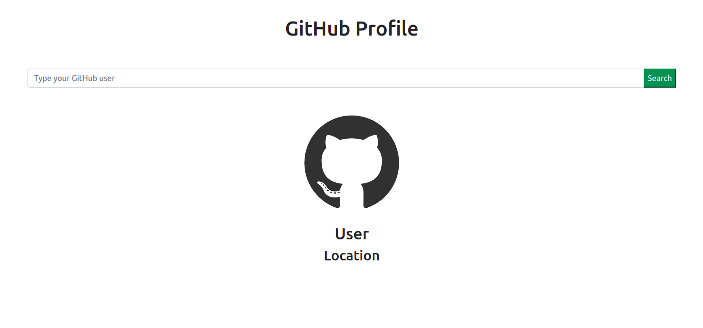

<h1 align="center">List GitHub Users</h1>

<h1 align="center">
    
</h1>

<p align="center">Simple React App using </p>

## Running the application
- You can use NPM or Yarn to run the project. In the project directory, use:

```console
yarn start
```
or
```console
npm run start
```
<br>

## 🛠️ Technologies

This project was developed with the following technologies:

 - ReactJS 
 - Bootstrap 5

## 📝️ License

This project is under the MIT license. Check the [LICENSE](LICENSE) file for more details.